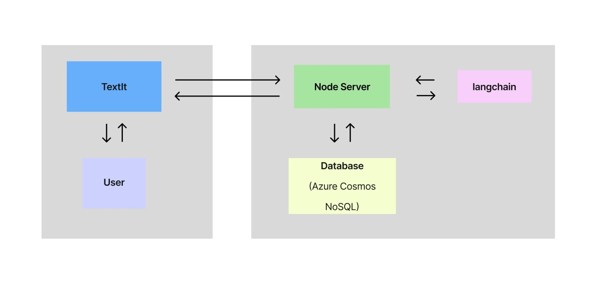

# PLH Project

This project uses Express, Azure Cosmos NoSQL DB and langchain.

## Setup

1. Install dependencies:

   ```sh
   yarn install
   ```

2. Create a `.env` file in the root directory and add your API keys:

   ```env
   look at .env.example
   ```

3. Start the node server locally:

   ```sh
   yarn dev
   ```

4. Make a request using Postman or curl:

   - Get scenario:

     ```sh
     curl --location 'http://localhost:3000/scenario1?lng=en' \
     --header 'x-api-key: <api_key>'
     ```

   - Post a chat message:
     ```sh
     curl --location 'http://localhost:3000/chat' \
     --header 'x-api-key: <api_key>' \
     --header 'Content-Type: application/json' \
     --data-raw '{
       "message": "Hello",
       "chat_id": "12345",
       "lng": "en"
     }'
     ```

   `lng` should be either en or es (defaults to en) for english or spanish support.

   `chat_id` is provided per flow/conversation automatically from textIt. When testing with postman or curl provide a new random one for a new conversation.

   ### Testing with Ngrok

   To expose the API for testing purposes, you can use [ngrok](https://ngrok.com/).
   While running `yarn dev` run `ngrok http http://localhost:3000` while running `yarn dev` and change the webhook endpoints in textIt for the url ngrok provides.

### Environment Variables

Environment variables such as `TOGETHER_AI_API_KEY` and `API_KEY` are managed in Azure.

### File Descriptions

- **app.js**: Contains all the endpoints for the application.
- **framework.js**: Contains all the AI prompting logic.
- **configHelper.js**: Handles accessing and parsing the `config.yaml` file.
- **databaseHelper.js**: Handles Database requests.

## Architecture Overview



## Deployment

This project is set up to deploy to Azure Web App Service using Bitbucket pipelines. When code is pushed to the `main` branch, the pipeline defined in `bitbucket-pipelines.yml` will run, building the application and then deploying it to Azure.

## Textit

The export for the [Textit](https://textit.com/) flow can be found in orgs_export_xxxxxxxx.json
